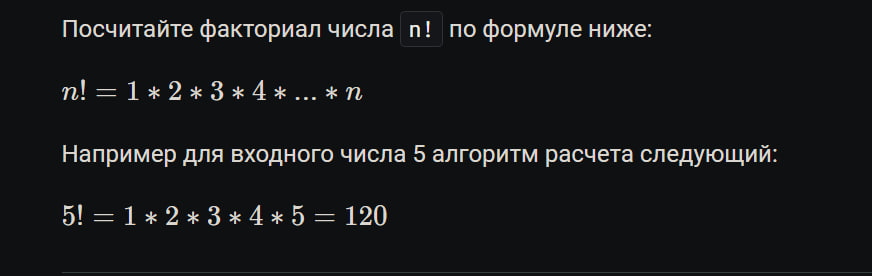
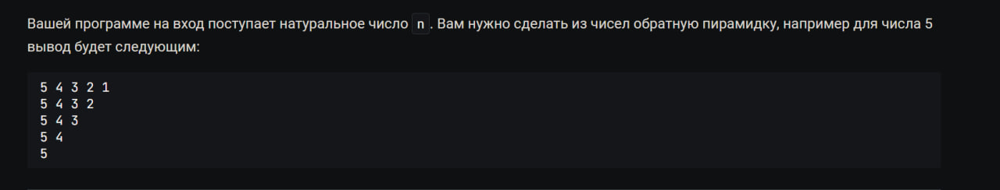
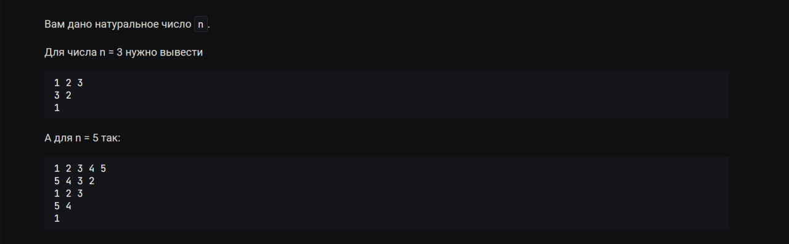
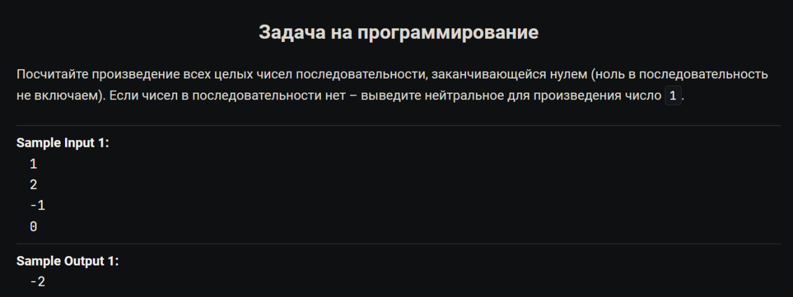

# **Задачи на программирование с курса на Stepik. "Python-Разработчик".** [Ссылка на сам курс.](https://stepik.org/course/122813/syllabus)

## В данном репозитории находятся мои варианты решений с данного курса. В данном файле условия к задачам и ссылки на их решения. 

### Содержание:
+ [Арифметические действия.](#Арифметические-действия)
      
   [Целые числа](#Целые-числа)

   [Числа с плавующей точкой](#Числа-с-плавующей-точкой)     
   
   [Битовые операции](#битовые-операции)   
   
   [Условные выражения](#условные-выражения)
   
   [Циклы](#Циклы)

   [Цикл и условия](#цикл-с-условием)   
  
   [Строки](#строки)

### *Арифметические действия.* 
   
#### *Целые числа*

     
[Решение](/int/output_the_formula.py)
    

> Задача:

         Представим, что вы разработчик серверных приложений. У вас есть потребность в измерении количества времени, которое
         проводят ваши пользователи на сайте. Фронтенд посылает вам время в минутах, которое пользователь провел на сайте.
         Вам в ответ нужно узнать сколько в этих минутах часов и минут.

         Или иными словами:

         Ваша программа принимает одну переменную m – количество минут, которое пользователь провел на сайте. Вам нужно
         определить сколько в этих минутах часов и оставшихся минут. 

[Решение](/int/Time_on_the_site.py) 

> Задача:

      На вход вашему серверу пришло время в минутах, которое провел пользователь на сайте , а также время начала сессии.
      Вам нужно определить сколько времени было на цифровых часах у пользователя, когда он закрывал сайт.

      Ваша программа получает на вход 3 переменные, каждая в новой строке:

      time_mins – количество минут, которое пользователь провел на сайте
      start_hours – время в часах, когда пользователь зашел на сайт
      start_mins – время в минутах, когда пользователь зашел на сайт
      Программа должна вывести через пробел количество часов и минут, когда пользователь закрыл сайт

[Решение](/int/Exit_time.py)

   

> Задача

        
         Пользователь сидит на сайте в среднем a минут и b секунд в день. Определите, сколько времени он будет находиться на
         сайте в течение n дней.

         Ваша программа получает на вход 3 переменные, каждая в новой строке:

         a – количество минут

         b – количество секунд

         n – количество дней

         В качестве результата программа должна вывести через пробел количество часов, минут и секунд, которые человек провел
         на сайте.

[Решение.](/int/Average_time_site.py) 

>Задача

      Программист решил купить квартиру стоимостью a рублей в ИТ-ипотеку на 3 года под y% годовых и с первоначальным
      взносом x рублей. Каждый год он выплачивает банку b рублей. Выведите остаток долга для банка на каждый год.

      Например, если квартира стоит 10 000 000 , ставка 5 % годовых, первоначальный взнос 1 000 000, а платит программист
      3 000 000, тогда

      Кредит: 10 000 000 - 1 000 000 = 9 000 000

      Первый год:
      Остаток: (9 000 000 - 3 000 000) * (1 + 5 / 100) = 6 300 000

      Второй год:
      Остаток: (6 300 000 - 3 000 000) * (1 + 5 /100) = 3 465 000

      Третий год:
      Остаток: (3 465 000 - 3 000 000) * (1 + 5 /100) = 488 250

      Вашей программе на вход идут переменные:

      a – стоимость квартиры,
      y – процент годовых,
      x – первоначальный взнос,
      b – ежегодная выплата.
      Стоимость квартиры всегда больше суммы взносов. На каждом этапе расчетов отбрасывайте остатки с помощью int.

      Вам нужно вывести долг банку на каждый год трехлетнего кредита. Каждое число нужно вывести в новой строке.

[Решение](/int/Debt_calculatio.py)

#### *Числа с плавующей точкой*

[Решение](/float/Equation_floating_number.py/Equation_floating_number.py)

> Задача:

      Дано дробное число x. Выведите вторую цифру после точки.

[Решение](/float/The_second_number.py)

    

> Задача:

      Семья решила заняться оптимизацией своих денежных расходов и придумала следующую схему:

      10 % доходов идут на отпуск
      30 % доходов на пропитание и еду
      5 % на коммунальные платежи
      15 % на выходной досуг
      остальные 40% идут в накопления
      Если вдруг нужный процент не получается сделать, тогда копейка перекидывается в накопления. Например:

      Сумма доходов равна 50 001.25 , 10 % от этой суммы это 5000.125 рублей. Пол копейки как валюты не существует,
      поэтому эта половинка переходит в накопления.

      Напишите для семьи программу, которая будет принимать на вход месячный доход мужа и жены и расчитывать сколько им
      нужно отложить на каждую категорию.

      Ваша программа принимает два числа типа float. Целая часть – рубли, а дробная – копейки.

      В качестве результата работы выведите количество рублей и копеек для каждой из категорий в таком формате:
      Отпуск: 10 руб. 5 коп.
      Пропитание и еда: 30 руб. 15 коп.
      Коммунальные платежи: 5 руб. 0 коп.
      Досуг: 10 руб. 11 коп.
      Накопления: 50 руб. 3 коп.

[Решение](/float/Cost_optimization.py)

>Задача модуль Demical 

    

[Решение.](/float/decimal_calculate_formula.py) 

> Задача.

      Вам требуется подобрать коробку, для вашего товара. Известно, что ширина, высота и глубина коробки – целые числа.
      Вашей программе даются на вход 3 числа с плавающей точкой – ширина, высота и глубина товара. Вам требуется подобрать для этого товара коробку. Выведите ширину, высоту и глубину коробки.

[Решение](/float/Select_box_size.py)

#### Битовые операции.
    

> Задача.
      Напишите программу, которая переведет десятичное число, которое дается на вход вашей программе, в 2, 8 и 16 системы счисления. В качестве ответа выведите представление числа в этих системах счисления.

      >>
            2-bin
            8-oct
            16-hex

[Решение](/Bit_operations/Numeral_systems.py)

> Задача

      Напишите программу, которая получает на вход число, представленное в 6-чной системе счисления и переводит его в 16-чную систему. Ваша программа должна вывести результат в 16-чной системе.

[Решение](/Bit_operations/numbe_translation_from6.py)

> Задача. 

      Если присмотреться к 8-ной системе счисления, то можно проследить алгоритм получения восьмеричного числа из десятичного. Сможете ли вы его найти и перевести число из 10-ной системы в 8-ную без использования функции oct?

      Ваша программа принимает на вход 10-ное число в интервале от 8 до 63 включительно. Напишите программу, которая переводит число из 10-ной системы в 8-ную систему счисления без использования oct. Программа должна вывести число в восьмеричном представлении.

[Решение](/Bit_operations/10to8_translation.py)
      
      
      
      
      
> Задача. 
      
      А что если бы вы использовали устройство с объемом памяти в 2 байта. Какое минимальное отрицательное число было бы для него возможно?

[Решение](/Bit_operations/2bit_negative.py)
    

> Задача.

      Ваша программа принимает натуральное число n – количество байт запоминающего устройства, которое может обрабатывать целые числа. Выведите через пробел минимальное и максимальное число, которое оно способно обработать

[Решение](/Bit_operations/Minimum_and_maximum.py) 

>Задача. 

      А сколько памяти в байтах занимает объект типа float?

[Решение](/Bit_operations/pomati_object.py)

>Задача.

      Вычислите выражение:
      x=13<<2>>1

[Решение](./Bit_operations/formula.py)

>Задача.
      Вам удалось получить ключ шифрования злоумышленника, и вы знаете что был применен алгоритм шифрования XOR. Расшифруйте зашифрованные сообщения. Программа получает на вход зашифрованное сообщение, нужно расшифровать его с помощью ключа.
      Ключ – 47

[Решение](/Bit_operations/Decryption.py)

#### Условные выражения

 
        

[Решение](/Conditions_of_expression/Number_interval.py)

> Задача. 

      Напишите программу, которая получает на вход целое число n и выводит 5 строк содержащих True или False с ответами на эти вопросы:

      1. Является ли число четным?

      2. Число является положительным?

      3. Число находится в промежутке от -5 включительно до 5 включительно?

      4. Число делится на 3 и 4, но не делится на 7?

      5. Является ли число трехзначным?

[Решение](/Conditions_of_expression/Characteristics_of_the_number.py)

> Задача. 

      Напишите программу, которая получает на вход две строки – логин и пароль пользователя. Определите верная ли это комбинация используя следующие условия:

      длина логина должна быть > 4;
      длина пароля должна быть > 8;
      логин не должен быть равен паролю.
      В качестве результата работы программы выведите True или False.

[Решение](/Conditions_of_expression/Len_login.py)

> Задача. 
      
      Ваша программа получает на вход целое число n. В случае если оно четное – прибавьте к нему 10, а если нечетное отнимите 10.

      В качестве вывода ваша программа должна выдать результат вычислений.

[Решение](/Conditions_of_expression/Even_Odd.py)

> Задача. 
            
      Пользователь вводит два целых числа a и b. Выведите меньшее из них.

[Решение](/Conditions_of_expression/Print_the_smaller_number.py)

> Задача

      Вам нужно написать программу, которая получает на вход целое число n и определяет какой день недели будет через n дней. Отсчет ведется от понедельника.

      Вам нужно вывести какой день недели будет через n дней. В качестве ответа выведите один из этих вариантов:

            пн
            вт
            ср
            чт
            пт
            сб
            вс
      Например если на вход пришло n = 10, тогда нужно вывести чт.

[Решение](/Conditions_of_expression/Calendar_days_countdown.py)

> Задача
      Вашему серверу на вход прилетает IP-адрес (v4) клиента. Нужно определить, что IP-адрес – правильный.

      IP-адрес (v4) считается правильным, когда его размер составляет 4 байта и состоит он из 4-х цифр. На каждую цифру приходится 1 байт, и следовательно максимальное число, которое там помещается – 255, а минимальное 0.

      Условия:

      Каждая цифра находится в интервале от 0 до 255 включительно.
      IP адрес не может быть 0.0.0.0 или 255.255.255.255, так как они зарезервированы для специального назначения.
      На вход вашей программе поступают 4 целых неотрицательных числа, разделенных точкой n1, n2, n3, n4 – они уже введены в программу, снова вводить их не нужно!

      В качестве ответа выведите True если IP-адрес правильный или False если неправильный.

[Решение](/Conditions_of_expression/Checking_ip.py)

> Задача

      Вашей программе на вход даются 3 строки. Выведите обратно строку наименьшей длины. В случае, если длина у нескольких строк совпадает – выведите ту, которая была введена позже остальных.

      Напоминаем, что посчитать длину строки можно с помощью len.

[Решение](/Conditions_of_expression/CountingStringLengths.py)

>Match/case работает в версиях от python3.10

      >Задача
      Давайте напишем своего бота-собеседника. Ваша задача написать программу, которая принимает одну строку на вход. И по ней определяет, что нужно ответить человеку.

      Бот должен знать команды:

      Привет - Привет!
      Как дела? - Все классно!
      Пока - До скорой встречи!
      Если введена неизвестная команда, нужно вывести сообщение Прости, я еще не знаю таких фраз :(
      Рекомендуем использовать знания, полученные в этой главе, например, моржовые операторы и match.
[Решение](./Conditions_of_expression/match_case.py)

>Задача 

      Представим, что вы программируете hr-сервис по работе с вакансиями. Обычно в языках программирования есть множество различных фреймворков, и каждый из них относится к определенному языку программирования и специальности. Напишите программу, которая по названию фреймворка будет определять язык и профессию человека.

      Flask, Django, Fast-API – Python(<framework>),Backend-dev
      Angular, React, Vue – JavaScript/TypeScript(<framework>),Frontend-dev
      Flutter, React Native – JavaScript(<framework>),Cross-Mobile-dev
      Pandas, skit-learn, keras – Python(<framework>),Data-Scientist
      В случае если фреймворк еще не известен – выведете "модель еще не обучена"

[Решиение](./Conditions_of_expression/vacancies.py)

#### Циклы.

>Задача 

      Допишите программу так, чтобы она выводила получаемый на вход список чисел из переменной a.

[Решение](./cycle/brute_force_output.py)

>Задача

      Напишите программу, которая перебирает значения переменной values и печатает их с восклицательными знаками.

[Решение](./cycle/String_addition.py)

>Задача

      Вашей программе на вход поступает два числа a и b. Выведите числа от a до b включительно, чередуя у них знак. Например, для чисел 5 и 10 нужно вывести: 
      
      >> 
            5
            -6
            7
            -8
            9
            -10

[Решение](./cycle/SequenceOfNumbers.py)

[Решение](./cycle/FactorialOfTheNumber.py)

[Решение](./cycle/Pyramid-Conclusion.py)
      

[Решение](./cycle/sequence_OfNumbers.py)

[Решение](./cycle/sequence_OfNumbers2.py)

#### Цикл с условием.

[Решение](./cycle/Multiplyinputю.py)

> Задача
      Вам дано целое неотрицательное число n. Нужно его перевернуть. Например, для числа 3214 нужно вывести 4123. Если вы переворачиваете число с нулями, и в обратной версии появляются незначащие нули, то их нужно убрать, например, для числа 100 ответом будет 1.

[Решение](./cycle/ReverseNumber.py)

> Задача
      Вам дано целое число n. Нужно определить, что число является палиндромом (слева направо и справа налево читается одинаково). Примеры палиндромов: 121, 1331, 222, 2, 11, 56165.

      В случае, если число является палиндромом, выведите True, в ином случае - False.

      Для тех, кто уже прошел уроки по строкам: сможете решить эту задачу в целых числах без приведения к строке?
      

      Я не стал усложнять себе жизнь. Поэтому:
      
      nums=str(input())
      print((nums[0:])==nums[::-1])

> Задача
      Вашему серверу на вход поступает маска подсети. Нужно определить, что маска – правильная.

      Условия:

      Маска, как и IP-v4 состоит из 4-х чисел, разделенных точкой
      Числа находятся в интервале от 0 до 255
      В бинарном представлении в маске сначала идут единицы, потом нули, перемешивать нельзя. Например, маска 255.255.254.0 в двоичном представлении равна 11111111 11111111 11111110 00000000 – это корректная маска. Но вот например 255.0.0.1 (11111111 00000000 00000000 00000001) уже не корректная.

      Мы учитываем все нули, незначащие тоже

      Учитывайте, что маска 1.1.1.1 тоже не является правильной, так как в двоичном представлении у нее нули и единицы перемешиваются 00000001 00000001 00000001 00000001

      Вашей программе на вход поступает 4 целых неотрицательных числа n1, n2, n3, n4 – они уже введены в программу. Вам нужно вывести True в том случае, если маска правильная или False, если она неправильная.

[Решение](./cycle/MaskRecalled.py)

> Задача
            В этой задаче вам нужно сначала определить, что IP-адрес и маска являются корректными. Условия такие же, как и в прошлых задачах.

            Далее по введенным IP-адресу и маске нужно определить адрес подсети. Сделать это можно с помощью битовой конъюнкции, например, первое число адреса можно определить выражением n1 & m1.

            Напоминаем вам условия коректности:

            Числа IP-адреса и маски должны быть в интервале от 0 до 255
            IP-адрес не может быть равным 0.0.0.0 и 255.255.255.255
            Маска в двоичном представлении должна иметь сначала подряд идущие единицы, а затем только нули. Например, маска 255.255.254.0 в двоичном представлении равна 11111111 11111111 11111110 00000000 – это корректная маска. Но вот, например, 255.0.0.1 (11111111 00000000 00000000 00000001) уже не корректная.
            Учитывайте, что маска 1.1.1.1 тоже не является правильной, так как в двоичном представлении у нее нули и единицы перемешиваются 00000001 00000001 00000001 00000001
            Вашей программе на вход поступают 8 целых неотрицательных чисел n1, n2, n3, n4 – числа обозначающие IP-адрес, и m1,m2,m3,m4 – числа, обозначающие маску. Они уже введены в программу.

            Вам нужно вывести, в случае если маска или IP-адрес не являются корректными, фразу Валидация не пройдена.

            Если данные корректны, нужно вычислить адрес подсети, например для IP-адреса 127.254.0.1 и маски 255.128.0.0 результат равен:

            127 & 255 = 127
            254 & 128 = 128
            0 & 0 = 0
            1 & 0 = 0
[Решение](./cycle/Validation.py)

> Задача
      
      Давайте напишем простого бота-счетовода, которому на вход поступают несколько команд, а он выполняет вычисления. У бота есть внутренний счетчик, который изначально равен 0, который он использует.

      zero – обнуляет число
      add <number> – добавляет к числу number
      minus <number> – отнимает число number
      mul <number> – умножает на число number
      div <number> – делит число нацело на number 
      result – выводит промежуточный результат
      exit – завершает выполнение программы
      number – всегда целое число!

      Ввод:

      Список команд, который завершается командой exit.

      Вывод:

      Все промежуточные выводы программы
[Решение](./cycle/accountant.py)

#### Строки

>Задача
      Для строк есть удобный метод определения является ли строка – числом. Найдите его и напишите программу, которая в случае, если строка не является целым положительным числом или нулем, выведет "не число", а в ином случае выведет его, умноженное на 3.

      p.s. Число означает, что строка состоит из циферок, пожалуйста не пишите программы, которые будут учитывать различные математические сокращения, кванторы и прочее:)

      Ввод:

      s – строка.

      Вывод:

      Число умноженное на 3 если s – число, иначе строку "не число".

[Решение](./str/task_one.py)

> Задача
      Напишите программу, которая получает на вход строку, и выводит каждый ее символ умноженный на индекс + 1.

      Используйте для решения задачи цикл for со счетчиком или for в комбинации с enumerate.

      Ввод:

      s – строка

      Вывод:

      Строки, содержащие символы строки s умноженные на индекс+1
[Решение](./str/index.py)

>Задача
      Выведите полученную строку в обратном порядке без первого символа.

      Ввод:

      s – строка

      Вывод:

      res – строка в обратном порядке без первого символа

[Решение](./str/the_reverse.py)

>Задача
      
            Дана строка длины не менее 4. Выведите:

      1. Ее второй символ, умноженный на 4

      2. Последние два символа строки, и добавьте к ним восклицательный знак

      3. Строку без трех последних символов

      4.Сделайте из строки палиндром при помощи добавления новых символов (слева направо и  справа налево читается одинаково, к 
      примеру слово "мадам")

      5. Все четные символы строки

      6. Все нечетные символы строки

      Ввод:

            s – строка

      Вывод:

            Строки содержащие решения пунктов 1-6
[Решение](./str/String_games.py)

>Задача
            Зашифруйте сообщение шифром цезаря.

      Например:

      abc -> def для шага 3

      На вход программе подается строка состоящая из букв латинского алфавита в нижнем регистре, которую нужно зашифровать и сдвиг, на который нужно сдвинуть буквы в слове. Проверка на сдвиг вне диапазона 1-26 не проводится.

      Ввод:

      s – строка состоящая из букв a-z

      step – шаг шифра, натуральное число

      Вывод:

      res – зашифрованная шифром строка

[Решение](./str/encrypts.py)

>Две задачи шифратор и дешифратор, отличие в знаке на step. В предыдущем решение, зашифровать прибовляем step, расшифровать отнимаем. 

> Задача

      Дана строка s. Найдите в ней подстроку, где наибольшее количество подряд идущих одинаковых символов. Выведите символ и длину последовательности. Если таких несколько – выведите последнюю.

      Ввод:

      s – строка

      Вывод:      

      res – символ последовательности

      acc – длина самой большой последовательности

[Решение](./str/due_date.py)