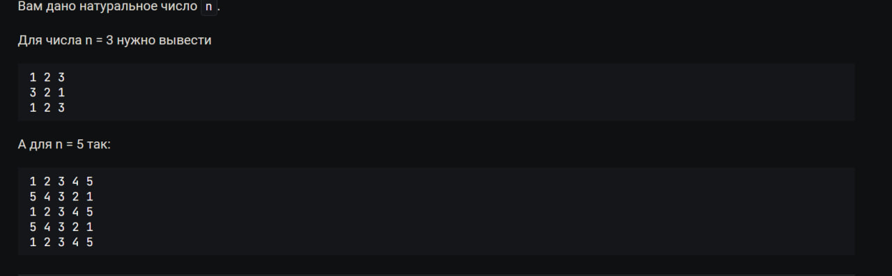

# **Задачи на программирование с курса на Stepik. "Python-Разработчик".** [Ссылка на сам курс.](https://stepik.org/course/122813/syllabus)

## В данном репозитории находятся варианты решений с курса. В данном файле условия к задачам и ссылки на их решения. 

### Содержание:

* [Арифметические действия.](#Арифметические-действия)

      

   [Целые числа](#Целые-числа)

   [Числа с плавующей точкой](#Числа-с-плавующей-точкой)     
   
   [Битовые операции](#битовые-операции)   
   
   [Условные выражения](#условные-выражения)
   
   [Циклы](#Циклы)

   [Цикл и условия](#цикл-с-условием)   
  
   [Строки](#строки)

### *Арифметические действия.* 

   

#### *Целые числа*


```python
a, b, c = int(input()), int(input()), int(input())

calculating = ((a**c) + (b**c)) ** (a * b)
print(calculating)

```

---

    

         Представим, что вы разработчик серверных приложений. У вас есть потребность в измерении количества времени, которое
         проводят ваши пользователи на сайте. Фронтенд посылает вам время в минутах, которое пользователь провел на сайте.
         Вам в ответ нужно узнать сколько в этих минутах часов и минут.

         Или иными словами:

         Ваша программа принимает одну переменную m – количество минут, которое пользователь провел на сайте. Вам нужно
         определить сколько в этих минутах часов и оставшихся минут. 

```python
minutes = int(input())
hour = minutes // 60
minutes_out = minutes - hour * 60
print(hour, minutes_out)
```

---

     На вход вашему серверу пришло время в минутах, которое провел пользователь на сайте , а также    время начала сессии.

      Вам нужно определить сколько времени было на цифровых часах у пользователя, когда он закрывал сайт.

      Ваша программа получает на вход 3 переменные, каждая в новой строке:

      time_mins – количество минут, которое пользователь провел на сайте
      start_hours – время в часах, когда пользователь зашел на сайт
      start_mins – время в минутах, когда пользователь зашел на сайт
      Программа должна вывести через пробел количество часов и минут, когда пользователь закрыл сайт.

```python
time_mins = int(input())
start_hours = int(input())
start_mins = int(input())

time_mins = (start_hours * 60) + start_mins + time_mins
time_hours, time_mins = (time_mins // 60), (time_mins % 60)

if time_hours <= 24:
    print(time_hours, time_mins)
else:
    print((time_hours - 24), time_mins)
```

---
   

        

       Пользователь сидит на сайте в среднем a минут и b секунд в день. Определите, сколько времени он будет находиться на
         сайте в течение n дней.

         Ваша программа получает на вход 3 переменные, каждая в новой строке:

         a – количество минут

         b – количество секунд

         n – количество дней

         В качестве результата программа должна вывести через пробел количество часов, минут и секунд, которые человек провел
         на сайте.

```python
minutes, seconds, days = int(input()), int(input()), int(input())

just_seconds = ((minutes * 60) + seconds) * days
hours = just_seconds // 60 // 60
minutes = just_seconds // 60 % 60
seconds = just_seconds % 60
print(hours, minutes, seconds)
```

---

  Программист решил купить квартиру стоимостью a рублей в ИТ-ипотеку на 3 года под y% годовых и с первоначальным

      взносом x рублей. Каждый год он выплачивает банку b рублей. Выведите остаток долга для банка на каждый год.

      Например, если квартира стоит 10 000 000 , ставка 5 % годовых, первоначальный взнос 1 000 000, а платит программист
      3 000 000, тогда

      Кредит: 10 000 000 - 1 000 000 = 9 000 000

      Первый год:
      Остаток: (9 000 000 - 3 000 000) * (1 + 5 / 100) = 6 300 000

      Второй год:
      Остаток: (6 300 000 - 3 000 000) * (1 + 5 /100) = 3 465 000

      Третий год:
      Остаток: (3 465 000 - 3 000 000) * (1 + 5 /100) = 488 250

      Вашей программе на вход идут переменные:

      a – стоимость квартиры,
      y – процент годовых,
      x – первоначальный взнос,
      b – ежегодная выплата.
      Стоимость квартиры всегда больше суммы взносов. На каждом этапе расчетов отбрасывайте остатки с помощью int.

      Вам нужно вывести долг банку на каждый год трехлетнего кредита. Каждое число нужно вывести в новой строке.

```python
full_amount = int(input())
percentages = int(input())
contribution = int(input())
payments = int(input())

debt = full_amount - contribution  # Долг с вычетов первого взноса.

debt = int((debt - payments) * (1 + percentages / 100))  # Рассчёт остатка на первый год
print(debt)

debt = int((debt - payments) * (1 + percentages / 100))  # Рассчёт остатка на второй год
print(debt)

debt = int((debt - payments) * (1 + percentages / 100))  # Рассчёт остатка на третий год
print(debt)

```

---

#### *Числа с плавующей точкой*


```python
import math

num1, num2, num3 = float(input()), float(input()), float(input())

up_equations = (num1**3) + (math.sqrt(num2))

print(up_equations / num3)
```

---

      Дано дробное число x. Выведите вторую цифру после точки.

```python
nums = str(float(input()))
print(int(nums[nums.find(".") + 1, +2]))
```

---

    

      Семья решила заняться оптимизацией своих денежных расходов и придумала следующую схему:

      10 % доходов идут на отпуск
      30 % доходов на пропитание и еду
      5 % на коммунальные платежи
      15 % на выходной досуг
      остальные 40% идут в накопления
      Если вдруг нужный процент не получается сделать, тогда копейка перекидывается в накопления. Например:

      Сумма доходов равна 50 001.25 , 10 % от этой суммы это 5000.125 рублей. Пол копейки как валюты не существует,
      поэтому эта половинка переходит в накопления.

      Напишите для семьи программу, которая будет принимать на вход месячный доход мужа и жены и расчитывать сколько им
      нужно отложить на каждую категорию.

      Ваша программа принимает два числа типа float. Целая часть – рубли, а дробная – копейки.

      В качестве результата работы выведите количество рублей и копеек для каждой из категорий в таком формате:
      Отпуск: 10 руб. 5 коп.
      Пропитание и еда: 30 руб. 15 коп.
      Коммунальные платежи: 5 руб. 0 коп.
      Досуг: 10 руб. 11 коп.
      Накопления: 50 руб. 3 коп.

```python
income_girl = float(input()) * 100
income_man = float(input()) * 100  # На вход подаётся доход двух людей.
income = int(income_girl + income_man)

def whole_sum_calculation(
    income,
):  # Для того чтобы вывести копейки нужно результаты функции %100, а целую часть на //100. Сделаем на выводе.
    vacation = 10 * income // 100  # Отпуск
    needs = 30 * income // 100  # Нужды
    communal = 5 * income // 100  # Коммуналка
    leisure = 15 * income // 100  # Досуг
    saving = income - (vacation + needs + communal + leisure)
    withdrawal(income, vacation, needs, communal, leisure, saving)

def withdrawal(income, vacation, needs, communal, leisure, saving):
    print("Отпуск:", (vacation // 100), "руб.", (vacation % 100), "коп.")
    print("Пропитание и еда:", (needs // 100), "руб.", (needs % 100), "коп.")
    print("Коммунальные платежи:", (communal // 100), "руб.", (communal % 100), "коп.")
    print("Досуг:", (leisure // 100), "руб.", (leisure % 100), "коп.")
    print("Накопления:", (saving // 100), "руб.", (saving % 100), "коп.")

whole_sum_calculation(income)  # запуск расчётов
```

---


    

```python
import decimal

num1, num2 = str(input()), str(input())  # Ввод чисел
out = decimal.getcontext().prec = 60  # Задаем точность числа ( знаки после запятой)
out = decimal.Decimal(num1).sqrt() + decimal.Decimal(num2)
print(out)

```

      Вам требуется подобрать коробку, для вашего товара. Известно, что ширина, высота и глубина коробки – целые числа.
      Вашей программе даются на вход 3 числа с плавающей точкой – ширина, высота и глубина товара. Вам требуется подобрать для этого товара коробку. Выведите ширину, высоту и глубину коробки.

```python
import math

Width, height, depth = float(input()), float(input()), float(input())

Width, height, depth = (
    int(math.ceil(Width)),
    int(math.ceil(height)),
    int(math.ceil(depth)),
)  # Идет округление в большую сторону.

for i in [Width, height, depth]:
    print(i)
```

---

#### Битовые операции.

    

      Напишите программу, которая переведет десятичное число, которое дается на вход вашей программе, в 2, 8 и 16 системы счисления. В качестве ответа выведите представление числа в этих системах счисления.

      >>
            2-bin
            8-oct
            16-hex

```python
num = int(input())
print(bin(num))
print(oct(num))
print(hex(num))

```

---

      Напишите программу, которая получает на вход число, представленное в 6-чной системе счисления и переводит его в 16-чную систему. Ваша программа должна вывести результат в 16-чной системе.

```python
print(hex(int(input(), 6)))
```

---

      Если присмотреться к 8-ной системе счисления, то можно проследить алгоритм получения восьмеричного числа из десятичного. Сможете ли вы его найти и перевести число из 10-ной системы в 8-ную без использования функции oct?

      Ваша программа принимает на вход 10-ное число в интервале от 8 до 63 включительно. Напишите программу, которая переводит число из 10-ной системы в 8-ную систему счисления без использования oct. Программа должна вывести число в восьмеричном представлении.

```python
num = int(input())
outcome = num + 2 * (num // 8)
print(outcome)
```

---

      

      

      А что если бы вы использовали устройство с объемом памяти в 2 байта. Какое минимальное отрицательное число было бы для него возможно?

```python
print(2 ** (2 * 8 - 1))
```

---

    

      Ваша программа принимает натуральное число n – количество байт запоминающего устройства, которое может обрабатывать целые числа. Выведите через пробел минимальное и максимальное число, которое оно способно обработать

```python
byte_quantity = int(input())

minimum_num = (2 ** (byte_quantity * 8 - 1)) * (-1)
maximum_num = int((2 ** (byte_quantity * 8) / 2))

print(minimum_num, maximum_num - 1)
```

---

      А сколько памяти в байтах занимает объект типа float?

```python
import sys

print(sys.getsizeof(0.0))
```

---

      Вычислите выражение:
      x=13<<2>>1

```python
print(13 << 2 >> 1)
```

---

      Вам удалось получить ключ шифрования злоумышленника, и вы знаете что был применен алгоритм шифрования XOR. Расшифруйте зашифрованные сообщения. Программа получает на вход зашифрованное сообщение, нужно расшифровать его с помощью ключа.
      Ключ – 47

```python
decryption = int(input())
print(decryption ^ 47)

```

---

#### Условные выражения


 

        

```python
num = int(input())
print(5 <= num < 10 or 200 >= num > 101)

```

---

      Напишите программу, которая получает на вход целое число n и выводит 5 строк содержащих True или False с ответами на эти вопросы:

      1. Является ли число четным?

      2. Число является положительным?

      3. Число находится в промежутке от -5 включительно до 5 включительно?

      4. Число делится на 3 и 4, но не делится на 7?

      5. Является ли число трехзначным?

```python
num = int(input())

print((num % 2) == 0)  # Четное или не четное
print(num > 0)  # Положительное или отрицательное
print(-5 <= num <= 5)  # Отрезок
print((num % 3 or num % 4) == 0 and num % 7 != 0)

if (
    num * (-1)
) > 0:  # Если число отричательное, умножаем на -1, чтобы получить положительное
    print((len(str(num * (-1)))) == 3)
else:
    print((len(str(num))) == 3)
```

---

      Напишите программу, которая получает на вход две строки – логин и пароль пользователя. Определите верная ли это комбинация используя следующие условия:

      длина логина должна быть > 4;
      длина пароля должна быть > 8;
      логин не должен быть равен паролю.
      В качестве результата работы программы выведите True или False.

```python
login = input()
password = input()

def checking_numbers(password, login):
    if (login.isdigit() == True) and (password.isdigit() == True):
        print(
            len(str(login)) > 4
            and len(str(password)) > 8
            and not int(login) == int(password)
        )
    else:
        login = len(str(login))
        password = len(str(password))
        print(login > 4 and password > 8 and not login == password)

checking_numbers(password, login)

```

---

      

      Ваша программа получает на вход целое число n. В случае если оно четное – прибавьте к нему 10, а если нечетное отнимите 10.

      В качестве вывода ваша программа должна выдать результат вычислений.

```python
num = int(input())
if num % 2 != 0:
    print(num - 10)
else:
    print(num + 10)

```

            
      Пользователь вводит два целых числа a и b. Выведите меньшее из них.

```python
num1, num2 = int(input()), int(input())
if num1 > num2:
    print(num2)
else:
    print(num1)

```

      Вам нужно написать программу, которая получает на вход целое число n и определяет какой день недели будет через n дней. Отсчет ведется от понедельника.

      Вам нужно вывести какой день недели будет через n дней. В качестве ответа выведите один из этих вариантов:

            пн
            вт
            ср
            чт
            пт
            сб
            вс
      Например если на вход пришло n = 10, тогда нужно вывести чт.

```python
"тема на if, elif, else"
amount_of_days = int(input())

def conclusion(day):
    if day == 0:
        print(("пн"))
    elif day == 1:
        print("вт")
    elif day == 2:
        print("ср")
    elif day == 3:
        print("чт")
    elif day == 4:
        print("пт")
    elif day == 5:
        print("сб")
    else:
        print("вс")

if amount_of_days >= 7:
    day = amount_of_days % 7
    conclusion(day)
else:
    day = amount_of_days
    conclusion(day)

```

      Вашему серверу на вход прилетает IP-адрес (v4) клиента. Нужно определить, что IP-адрес – правильный.

      IP-адрес (v4) считается правильным, когда его размер составляет 4 байта и состоит он из 4-х цифр. На каждую цифру приходится 1 байт, и следовательно максимальное число, которое там помещается – 255, а минимальное 0.

      Условия:

      Каждая цифра находится в интервале от 0 до 255 включительно.
      IP адрес не может быть 0.0.0.0 или 255.255.255.255, так как они зарезервированы для специального назначения.
      На вход вашей программе поступают 4 целых неотрицательных числа, разделенных точкой n1, n2, n3, n4 – они уже введены в программу, снова вводить их не нужно!

      В качестве ответа выведите True если IP-адрес правильный или False если неправильный.

```python
n1, n2, n3, n4 = [int(i) for i in input().split(".")]

def out(n1, n2, n3, n4):
    if (n1 == 0) and (n2 == 0) and (n3 == 0) and (n4 == 0):
        print("False")
    elif (n1 == 255) and (n2 == 255) and (n3 == 255) and (n4 == 255):
        print("False")
    else:
        print("True")

if (n1 > 255) or (n2 > 255) or (n3 > 255) or (n4 > 255):
    print("False")
else:
    out(n1, n2, n3, n4)

```

      Вашей программе на вход даются 3 строки. Выведите обратно строку наименьшей длины. В случае, если длина у нескольких строк совпадает – выведите ту, которая была введена позже остальных.

      Напоминаем, что посчитать длину строки можно с помощью len.

```python
(
    str1,
    str2,
    str3,
) = (
    str(input()),
    str(input()),
    str(input()),
)
if len(str1) == len(str2) and (len(str2) != len(str3)):
    print(str2)
elif (len(str1) == len(str3)) or (len(str2) == len(str3)):
    print(str3)
else:
    print(min(str1, str2, str3, key=len))  # Вывод самой минимальной строки.
```

> Match/case работает в версиях от python3.10

    

      Давайте напишем своего бота-собеседника. Ваша задача написать программу, которая принимает одну строку на вход. И по ней определяет, что нужно ответить человеку.

      Бот должен знать команды:

      Привет - Привет!
      Как дела? - Все классно!
      Пока - До скорой встречи!
      Если введена неизвестная команда, нужно вывести сообщение Прости, я еще не знаю таких фраз :(
      Рекомендуем использовать знания, полученные в этой главе, например, моржовые операторы и match.

```python
match dialogue:= str(input()):
    case 'Привет':
        print('Привет!')
    case 'Как дела?': 
        print('Все классно!')    
    case 'Пока':
        print('До скорой встречи!')
    case _:
        print('Прости, я еще не знаю таких фраз :(')
```

      Представим, что вы программируете hr-сервис по работе с вакансиями. Обычно в языках программирования есть множество различных фреймворков, и каждый из них относится к определенному языку программирования и специальности. Напишите программу, которая по названию фреймворка будет определять язык и профессию человека.

      Flask, Django, Fast-API – Python(<framework>),Backend-dev
      Angular, React, Vue – JavaScript/TypeScript(<framework>),Frontend-dev
      Flutter, React Native – JavaScript(<framework>),Cross-Mobile-dev
      Pandas, skit-learn, keras – Python(<framework>),Data-Scientist
      В случае если фреймворк еще не известен – выведете "модель еще не обучена"

```python
match vacancies := str(input()):
    case 'Flask' |'Django' |'Fast-API': #Python
        print('Python','(',vacancies,')',',Backend-dev', sep='')
    case 'Angular'|'React'|'Vue':
        print('JavaScript/TypeScript','(', vacancies,')',',Frontend-dev', sep='')
    case 'Flutter' |'React Native':
        print( 'JavaScript','(',vacancies,')',',Cross-Mobile-dev', sep='')
    case 'Pandas' |'skit-learn'|'keras':
        print('Python','(',vacancies,')',',Data-Scientist', sep='')
    case _:
        print("модель еще не обучена")
```

#### Циклы.

      Допишите программу так, чтобы она выводила получаемый на вход список чисел из переменной a.

```python
str1 = str(input()).split()
for i in str1:
    print(i)

```

      Напишите программу, которая перебирает значения переменной values и печатает их с восклицательными знаками.

```python
values = str(input()).split()
for i in values:
    print(i + "!")
```

      Вашей программе на вход поступает два числа a и b. Выведите числа от a до b включительно, чередуя у них знак. Например, для чисел 5 и 10 нужно вывести: 

      

      >> 
            5
            -6
            7
            -8
            9
            -10

```python
starting, ending = int(input()), int(input())
num=0
for i in range(starting,ending+1):
    num+=1
    if (num%2)==0:
        print(i*(-1))
    else:
        print(i)

```


```python
num = int(input())
num_out=1
for i in range(1,num+1):
    num_out*=i
print(num_out)

```


```python
num = int(input())
k = -1
for i in range(num):
    k += 1
    for j in range(num, k, -1):
        print(j, end=" ")

    print()

```

      



```python

num = int(input())
k = -1
for i in range(num):
    k += 1
    for j in range(num, k, -1):
        print(j, end=" ")

    print()

```


```python

n = int(input())

for i in range(n):
    if i % 2 == 0:
        for j in range(1, n+1):
            print(j, end=' ')
    else:
        for j in range(n, 0, -1):
            print(j, end=' ')
    print()

```

#### Цикл с условием.


```python
nums_out = 1
while nums_out != 0:
    nums = int(input())
    if nums == 0:
        print(nums_out)
        break
    elif nums != 0:
        nums_out *= nums

```

      Вам дано целое неотрицательное число n. Нужно его перевернуть. Например, для числа 3214 нужно вывести 4123. Если вы переворачиваете число с нулями, и в обратной версии появляются незначащие нули, то их нужно убрать, например, для числа 100 ответом будет 1.

```python
num=str(input())
num1=num[::-1]
score=0
for i in (num1):
    if int(i)==0:
        score+=1
    else:
        break
if int(num)==0:
    print(num) 
else:
    print(num1[score:])

```

      Вам дано целое число n. Нужно определить, что число является палиндромом (слева направо и справа налево читается одинаково). Примеры палиндромов: 121, 1331, 222, 2, 11, 56165.

      В случае, если число является палиндромом, выведите True, в ином случае - False.

      Для тех, кто уже прошел уроки по строкам: сможете решить эту задачу в целых числах без приведения к строке?

      

      Я не стал усложнять себе жизнь. Поэтому:

  ```python    

      nums=str(input())
      print((nums[0:])==nums[::-1])

```

      Вашему серверу на вход поступает маска подсети. Нужно определить, что маска – правильная.

      Условия:

      Маска, как и IP-v4 состоит из 4-х чисел, разделенных точкой
      Числа находятся в интервале от 0 до 255
      В бинарном представлении в маске сначала идут единицы, потом нули, перемешивать нельзя. Например, маска 255.255.254.0 в двоичном представлении равна 11111111 11111111 11111110 00000000 – это корректная маска. Но вот например 255.0.0.1 (11111111 00000000 00000000 00000001) уже не корректная.

      Мы учитываем все нули, незначащие тоже

      Учитывайте, что маска 1.1.1.1 тоже не является правильной, так как в двоичном представлении у нее нули и единицы перемешиваются 00000001 00000001 00000001 00000001

      Вашей программе на вход поступает 4 целых неотрицательных числа n1, n2, n3, n4 – они уже введены в программу. Вам нужно вывести True в том случае, если маска правильная или False, если она неправильная.

```python
correct_list = [
    "0.0.0.0",
    "128.0.0.0",
    "192.0.0.0",
    "224.0.0.0",
    "240.0.0.0",
    "248.0.0.0",
    "252.0.0.0",
    "254.0.0.0",
    "255.0.0.0",
    "255.128.0.0",
    "255.192.0.0",
    "255.224.0.0",
    "255.240.0.0",
    "255.248.0.0",
    "255.252.0.0",
    "255.254.0.0",
    "255.255.0.0",
    "255.255.128.0",
    "255.255.192.0",
    "255.255.224.0",
    "255.255.240.0",
    "255.255.248.0",
    "255.255.252.0",
    "255.255.254.0",
    "255.255.255.0",
    "255.255.255.128",
    "255.255.255.192",
    "255.255.255.224",
    "255.255.255.240",
    "255.255.255.248",
    "255.255.255.252",
    "255.255.255.254",
    "255.255.255.255",
]
adress=str(input())
score=0
for i in (correct_list):
    if str(i)==adress:
        score+=1
if score==1:
    print(True)
else:
    print(False)

```

            В этой задаче вам нужно сначала определить, что IP-адрес и маска являются корректными. Условия такие же, как и в прошлых задачах.

            Далее по введенным IP-адресу и маске нужно определить адрес подсети. Сделать это можно с помощью битовой конъюнкции, например, первое число адреса можно определить выражением n1 & m1.

            Напоминаем вам условия коректности:

            Числа IP-адреса и маски должны быть в интервале от 0 до 255
            IP-адрес не может быть равным 0.0.0.0 и 255.255.255.255
            Маска в двоичном представлении должна иметь сначала подряд идущие единицы, а затем только нули. Например, маска 255.255.254.0 в двоичном представлении равна 11111111 11111111 11111110 00000000 – это корректная маска. Но вот, например, 255.0.0.1 (11111111 00000000 00000000 00000001) уже не корректная.
            Учитывайте, что маска 1.1.1.1 тоже не является правильной, так как в двоичном представлении у нее нули и единицы перемешиваются 00000001 00000001 00000001 00000001
            Вашей программе на вход поступают 8 целых неотрицательных чисел n1, n2, n3, n4 – числа обозначающие IP-адрес, и m1,m2,m3,m4 – числа, обозначающие маску. Они уже введены в программу.

            Вам нужно вывести, в случае если маска или IP-адрес не являются корректными, фразу Валидация не пройдена.

            Если данные корректны, нужно вычислить адрес подсети, например для IP-адреса 127.254.0.1 и маски 255.128.0.0 результат равен:

            127 & 255 = 127
            254 & 128 = 128
            0 & 0 = 0
            1 & 0 = 0

```python
correct_list = [
    "0.0.0.0",
    "128.0.0.0",
    "192.0.0.0",
    "224.0.0.0",
    "240.0.0.0",
    "248.0.0.0",
    "252.0.0.0",
    "254.0.0.0",
    "255.0.0.0",
    "255.128.0.0",
    "255.192.0.0",
    "255.224.0.0",
    "255.240.0.0",
    "255.248.0.0",
    "255.252.0.0",
    "255.254.0.0",
    "255.255.0.0",
    "255.255.128.0",
    "255.255.192.0",
    "255.255.224.0",
    "255.255.240.0",
    "255.255.248.0",
    "255.255.252.0",
    "255.255.254.0",
    "255.255.255.0",
    "255.255.255.128",
    "255.255.255.192",
    "255.255.255.224",
    "255.255.255.240",
    "255.255.255.248",
    "255.255.255.252",
    "255.255.255.254",
    "255.255.255.255",
]
num1, num2, num3, num4 = [int(i) for i in input().split(".")]
adress = str(input())

def check_validations(ip_adress, mask):
    if (ip_adress == False) or (mask == False):
        print("Валидация не пройдена")
    else:
        #слияние ip и маски
        mask1, mask2, mask3, mask4 = [int(i) for i in adress.split(".")]
        out1 = str(num1 & mask1)
        out2 = str(num2 & mask2)
        out3 = str(num3 & mask3)
        out4 = str(num4 & mask4)
        print(out1,out2,out3,out4,sep='.')

""" Проверка маски на корректоность"""
score = 0
for i in correct_list:
    if str(i) == adress:
        score += 1
if score == 1:
    mask = True
else:
    mask = False

""" Проверка ip адреса на корректоность"""

def out_ip(num1, num2, num3, num4):
    if num1 > 255 or num2 > 255 or num3 > 255 or num4 > 255:
        ip_adress = False
    elif num1 == 0 and num2 == 0 and num3 == 0 and num4 == 0:
        ip_adress = False
    elif num1 == 255 and num2 == 255 and num3 == 255 and num4 == 255:
        ip_adress = False
    else:
        ip_adress = True

    check_validations(ip_adress, mask)

out_ip(num1, num2, num3, num4)

```

      

      Давайте напишем простого бота-счетовода, которому на вход поступают несколько команд, а он выполняет вычисления. У бота есть внутренний счетчик, который изначально равен 0, который он использует.

      zero – обнуляет число
      add <number> – добавляет к числу number
      minus <number> – отнимает число number
      mul <number> – умножает на число number
      div <number> – делит число нацело на number 
      result – выводит промежуточный результат
      exit – завершает выполнение программы
      number – всегда целое число!

      Ввод:

      Список команд, который завершается командой exit.

      Вывод:

      Все промежуточные выводы программы

```python
action = "a"
num = 0
while action[0] != "exit":
    action = str(input()).split()
    if action[0]=="zero":
            num*=0
    elif action[0]=="result":
                print(num)
    elif action[0]=="add":
            num+=(int(action[1]))
    elif action[0]=="minus":
        num-=(int(action[1]))
    elif action[0]=="mul":
        num*=(int(action[1]))
    elif action[0]=="div":
        num//=(int(action[1]))

```

#### Строки

      Для строк есть удобный метод определения является ли строка – числом. Найдите его и напишите программу, которая в случае, если строка не является целым положительным числом или нулем, выведет "не число", а в ином случае выведет его, умноженное на 3.

      p.s. Число означает, что строка состоит из циферок, пожалуйста не пишите программы, которые будут учитывать различные математические сокращения, кванторы и прочее:)

      Ввод:

      s – строка.

      Вывод:

      Число умноженное на 3 если s – число, иначе строку "не число".

```python

nums=str(input())
score= nums.isdigit()
if score==False:
    print('не число')
else:
    print(int(nums)*3)

```

---

      Напишите программу, которая получает на вход строку, и выводит каждый ее символ умноженный на индекс + 1.

      Используйте для решения задачи цикл for со счетчиком или for в комбинации с enumerate.

      Ввод:

      s – строка

      Вывод:

      Строки, содержащие символы строки s умноженные на индекс+1

```python
string=str(input())
for index,volue in enumerate(string):
    print(volue*(int(index)+1))

```

      Выведите полученную строку в обратном порядке без первого символа.

      Ввод:

      s – строка

      Вывод:

      res – строка в обратном порядке без первого символа

```python
s=str(input())
st=s[1:]
print(st[::-1])
```

      

            Дана строка длины не менее 4. Выведите:

      1. Ее второй символ, умноженный на 4

      2. Последние два символа строки, и добавьте к ним восклицательный знак

      3. Строку без трех последних символов
      4.Сделайте из строки палиндром при помощи добавления новых символов (слева направо и  справа налево читается одинаково, к 
      примеру слово "мадам")

      5. Все четные символы строки

      6. Все нечетные символы строки

      Ввод:

            s – строка

      Вывод:

            Строки содержащие решения пунктов 1-6

```python
string=str(input())
string_score=len(string)

print(string[1]*4)
print(string[string_score-2:]+'!')
print(string[0:string_score-3])
print(string,string[::-1],sep='')
print(string[1::2])
print(string[0::2])

```

            Зашифруйте сообщение шифром цезаря.

      Например:

      abc -> def для шага 3

      На вход программе подается строка состоящая из букв латинского алфавита в нижнем регистре, которую нужно зашифровать и сдвиг, на который нужно сдвинуть буквы в слове. Проверка на сдвиг вне диапазона 1-26 не проводится.

      Ввод:

      s – строка состоящая из букв a-z

      step – шаг шифра, натуральное число

      Вывод:

      res – зашифрованная шифром строка

```python
chiper=str(input())
step=int(input())
out=''
for i in chiper:
    out+=chr((ord(i)+step- 97) % 26 + 97)
print(out)

```

> Две задачи шифратор и дешифратор, отличие в знаке на step. В предыдущем решение, зашифровать прибовляем step, расшифровать отнимаем. 

      Дана строка s. Найдите в ней подстроку, где наибольшее количество подряд идущих одинаковых символов. Выведите символ и длину последовательности. Если таких несколько – выведите последнюю.

      Ввод:

      s – строка

      Вывод:      

      res – символ последовательности

      acc – длина самой большой последовательности

```python
istr = input()
nmax = 0
chmax = '\0'
n = 1
pch = '\0'
for ch in istr:
  if ch != pch:
    n = 1
  if n >= nmax:
    chmax = ch
    nmax = n
  pch = ch
  n += 1

print(chmax)
print(nmax)
```

Вам дана строка s. Определите количество слов в строке, записанных через пробел.

```python
s= str(input()).split()
print(len(s))
```

      Дано вещественное число n. Отформатируйте число до трех знаков после запятой с использованием f-строк.

```pethon
            num=float(input())
            out=f'{num:.3f}'
            print(out)
```

#### Составные структуры данных. Кортежи.

      На вход вашей программе поступает список целых чисел через пробел.

      Напишите программу которая выводит произведение этих чисел.

      Ввод:

      Список целых чисел через пробел

      Вывод:

      res – произведение чисел

```python
numbers=input().split()
out=1
for i in numbers:
    out*=int(i)
print(out)
```

      На вход вашей программе поступает список целых чисел через пробел (минимум 2)

      Напишите программу, которая выводит через пробел суммы чисел стоящих рядом друг с другом.

      Ввод:

      Список целых чисел через пробел

      Вывод:      

      Список сумм чисел, находящихся рядом, записанных через пробел

```python
nums, score,out = [int(i) for i in input().split()], 1,''
for i in nums[0:len(nums)-1]:
    out+=str(i+int(nums[score]))+" "
    score+=1
print(out, end='')

```

      На вход вашей программе поступает список целых чисел через пробел.

      Напишите программу которая определяет второе по величине число в списке.

      Ввод:

      Список не менее двух целых чисел, записанных через пробел

      Вывод:

      res – второй максимум (второе по величине число)

```python
nums=list(set(input().split()))
nums.sort(reverse=True)
print(nums[1])

```

      На вход вашей программе поступает список целых чисел через пробел.

      Отсортируйте массив так, чтобы все нули в нем оказались в конце массива, сохранив при этом порядок чисел.

      Ввод:

      Список целых чисел через пробел

      Вывод:

      Список чисел в котором нули находятся в конце.

```python
nums=[int(i) for i in input().split()]
score=nums.count(0)
delN=0
nums=list(filter((delN).__ne__,nums))
if score==0: 
    print(*nums)

else:
    out=nums+([0]*score)
    print(*out)

```

На вход вашей программе поступает список целых чисел через пробел.

Удалите из массива все элементы, значения которых являются нечетными.

Ввод:

Список целых чисел через пробел

Вывод:

Четные элементы массива

```python
nums=[int(i) for i in input().split()]
out=[]
for i in nums:
    if i % 2==0:
        out.append(i)
print(*out)

```

На вход вашей программе поступает список целых чисел через пробел.

Найдите медиану этого списка. (медиана это значение по центру в отсортированном списке, причем если длина четная то возьмите среднее арифметическое двух значений)

В случае если ответом является дробное число – округлите его до одного знака после запятой. Если ответ – целое число, выведите его без дробной части.

Ввод:

Список целых чисел через пробел

Вывод:

res – медиана списка

```python
nums = [int(i) for i in input().split()]
nums.sort()
if len(nums) % 2 == 1:
   
    print(nums[1])
elif len(nums) % 2 == 0:
    out = (nums[2] + nums[1]) / 2
    if out % 1 == 0:
        print(int(out))
    else:
        print(out)
```

      Перебрать элементы множества можно при помощи цикла for. Напишите программу, которая посчитает сумму квадратов чисел в заданном множестве.

      Ввод:

      a – множество целых чисел 

      Вывод:

      res – сумма чисел

```python
num = {int(i) for i in input().split()}
out=(sum(x **2  for x in num))
print(out) 

```

      Представьте, что у вас есть формочка на сайте для ввода строк. Ваш менеджер сказал вам, что в этой формочке обязательно должны быть строки из первого множества, а так же опционально можно добавить строки из второго, или не добавлять вообще. Проверьте, что множество строк, которое ввел вам пользователь в эту формочку подходит по заданным условиям.

      Вашей программе на вход поступают 3 множества. Каждое на отдельной строке. Элемент множеств отделены друг от друга пробелом.

      Первое множество – обязательные строки
      Второе множество – опциональные строки
      Третье множество – строки введенные пользователем
      Выведите True, если пользователь ввел все правильно и False, если ошибся.

      Ввод:

      required – множество обязательных строк

      optional – множество опциональных строк

      user_data – множество строк, которые ввел пользователь строк

```python
required = set(input())
optional = set(input())
user_data = set(input())
if optional & user_data | required == user_data:
    print(True)
else:
    print(False)
```

      Вам дана строка из слов, разделенных пробелами. Посчитайте для каждого слова – сколько оно раз встречалась в тексте.

      Ввод:

      s – строка, разделенная пробелами

      Вывод:

      key ,res – где key – слово, а res – количество раз, сколько оно встретилось в строке. Ключи отсортируйте в алфавитном порядке

```python
list_1 = list(input().split())
set_1 = set(list_1)
dict_1 = {i: list_1.count(i) for i in set_1}
dict_sort = list(sorted(dict_1.items()))
for key, values in dict_sort:
    print("{0} {1}".format(key, values))

```

      Вашей программе на вход подается массив содержащий объекты со структурой ниже.

```python
{

    "id": 1,
    "parents": [1,2,3,4],
    "chief": {
        "name": "Paul",
        "age": 50
    },
    "age": 22

}
```

#### Множества и словари. 

            Определите максимальное значение во всех полях age этого объекта.

      Ввод:

      d – json-объект

      Вывод:

      res – максимальный возраст

```python

import json

Data = json.loads(input())

out=set( )
for i in Data:
    num,num1 = (i["chief"]["age"], i["age"])
    out.add(max(num, num1))
print(max(out))

```

Вы парсите логи сервера. Напишите программу, которая будет считать количество запросов к серверу, сгруппированных по статус кодам, а так же ниже количество запросов, сгруппированных по адресу. Отсортируйте результат по возрастанию.

Ввод заканчивается ключевым словом end.

P. S. для вашего удобства адреса /users/1/delete и /users/2/delete считайте как разные

Ввод:

request, http_code – адрес и http код, записанные через пробел

Вывод:

Для каждого статус кода, отсортированное по возрастанию –

http_code, res – код и количество запросов к нему

Для каждого адреса, отсортированного по алфавиту –

request, res – адрес и количество запросов к нему

P. S. S не забудьте использовать стандартные библиотеки, которые подойдут под вашу задачу!

```python
from collections import Counter
url_counts  = Counter()
code_counts = Counter()
strings=list()
while (x:= (input())) != ('end'):
    strings.append(x)
for string in strings:
        url, status_code = string.split(" ")
        
        url_counts.update({ url: 1 })
        code_counts.update({ status_code: 1 })
for status_code, quantity in sorted(code_counts.items()):
    print(status_code, quantity)

for url, quantity in sorted(url_counts.items()):
    print(url, quantity)
```

#### Стек, очередь, куча

Вам дана последовательность чисел заканчивающаяся -1. Выведете ее в обратном порядке без учета -1.

Ввод:

Последовательность чисел

Вывод:

Последовательность чисел в обратном порядке.

```python
listings=list()
while (entering:= int(input())) != (-1):
    listings.append(entering)

listings=(''.join(map(str, listings)))

for out in listings[::-1]:
    print(out)
```

Напишите программу, которая будет эмулировать функциональность стека. Вам на вход будут поступать четыре команды:

    add <число> – добавить в стек число
    pop – удалить из стека число и напечатать его
    head – вывести текущий элемент стека
    close – завершить программу

Ввод:

Список комманд

Вывод:

Ответы на команды 

```python
strings=list()
while True:
    text= str(input()).split(' ')
    if len(text)==2:
        num = text[1]
        strings.append(num)
    else:
        command= ''.join(text)
        match command: 
            case 'pop':
                print (strings.pop())

            case 'head':
                print(strings[-1])

            case 'close':
               break   
```

Напишите программу, которая будет эмулировать функциональность очереди. Вам на вход будут поступать три команды:

    add <число> – добавить в очередь число
    pop – удалить из очереди число и напечатать его
    head – вывести текущий элемент очереди
    close – завершить программу

Ввод:

Список комманд

Вывод:

Ответы на команды 

```python
from collections import deque

queue = deque()

while True:
    text = str(input()).split(' ')
    if len(text)==2:
        num=text[1]
        queue.appendleft(num)
    else:
        command=''.join(text)

        match command:
            case 'pop':
                print(queue.pop())
            case 'close':
                break
            case 'head':
                print(queue[-1])
```

Дан список чисел, записанных через пробел. Реализуйте кучу с максимумом в вершине для этого списка.

Далее программе на вход будут поступать команды:

    insert <число> – добавить число в кучу;
    pop – удалить вершину и напечатать ее;
    end – завершить выполнение программы.

Ввод:

    nums – список чисел записанных через пробел
    Список команд.

Вывод:

Результаты работы программы

```python
from heapq import heappush, heappop
heap=[]
nums=list(input().split())
for numbers in nums:
    heappush(heap,(int(numbers)*-1))

while True:
    text=list(input().split())
    if len(text)==2:
        num =(int(text[1]))*-1
        heappush(heap,num)
    else:
        match str(text[0]):
            case "pop":
                print(heappop(heap)*-1)
            case 'end':
                break
```

Реализуйте очередь с приоритетами на базе кучи с максимумом в вершине – самый большой элемент всегда идет первее. Если делаете без кучи – имейте в виду, что сортировать нужно одновременно по приоритету и номеру.

Вашей программе поступают на вход команды:

    task <номер задачи>,<приоритет> – добавить задачу;
    take – взять задачу в работу, вывести в консоль лог (Задача <номер задачи> с приоритетом <приоритет>);
    end – завершить выполнение программы.

Ввод:

Список команд.

Вывод:

Результат работы программы.

```python

from heapq import heappop, heappush, heapify

heap = []
heapify(heap)

priority = {}

while True:
    promt = input()
    if 'task' in promt:
        task = promt.split(',')[0]
        task_is = int(task.split()[1])
        pri = int(promt.split(',')[1])

        priority[task] = task_is

        heappush(heap, (-pri,-task_is))
        

    elif 'take' in promt:
        pop_is = heappop(heap)
        num_is = -pop_is[1]
        pri_is = -pop_is[0]

        print(f'Задача {num_is} с приоритетом {pri_is}')
        
    elif 'end' in promt:
        break

```

#### Модули и библиотеки

Напишите программу, которая получает на ввод n строк, состоящих из двух слов разделенных пробелом, и выводит сгруппированные элементы по второму слову, и отсортированные по алфавиту. Разделите каждую группу при помощи строки <->.

Ввод:

n – количество строк

n строк состоящих из двух слов, разделенных пробелом.

Вывод:

Группы сформированные по второму слову, отсортированные по алфавиту и разделенные символом <->.

```python
d = {}
for i, j in [input().split() for string in range(int(input()))]:
    d.setdefault(j, []).append(i)

print(*['\n'.join([f'{k} {v}' for v in sorted(vs)]) for k, vs in sorted(d.items())], sep='\n<->\n')
```

Сначала вашей программе на вход поступает поток чисел. Сохраните их в массиве в отсортированном виде. После ключевого слова "change" меняется состояние программы, и на каждое введенное число она должна выдавать индекс элемента, на котором находится данное число (правый). Программа завершается, когда встречает слово "close".

Последовательности чисел состоят хотя бы из одного числа, ключевые слова change и close всегда будут в вводе.

Ввод:

Числа массива, которые нужно хранить в программе.

Числа, индекс которых нужно определить.

Вывод:

Определенные индексы

```python
import bisect
listing=[]

while (user_data:=input())!='change':
    bisect.insort(listing,int(user_data))

while (index_listing:=input()) != 'close':
    print(bisect.bisect_right(listing,int(index_listing))-1)
```

Напишите программу, которая будет заменять символы строки на другую раскладку клавиатуры. Программа должна работать в обе стороны.

Ввод:

Строка s, состоящая из символов. В случае русской раскладки – на вход идут только буквы в нижнем регистре, в обратном случае – их эквиваленты на клавише клавиатуры.

Вывод:

Строка в другой раскладке клавиатуры


```python
listing = {'й': 'q', 'ц': 'w', 'у': 'e', 'к': 'r', 'е': 't', 'н': 'y', 'г': 'u', 'ш': 'i', 'щ': 'o', 'з': 'p', 'х': '[', 'ъ': ']', 'ф': 'a', 'ы': 's', 'в': 'd', 'а': 'f', 'п': 'g', 'р': 'h', 'о': 'j', 'л': 'k', 'д': 'l', 'ж': ';', 'э': "'", 'я': 'z', 'ч': 'x', 'с': 'c', 'м': 'v', 'и': 'b', 'т': 'n', 'ь': 'm', 'б': ',', 'ю': '.',
           'ё': '`', 'q': 'й', 'w': 'ц', 'e': 'у', 'r': 'к', 't': 'е', 'y': 'н', 'u': 'г', 'i': 'ш', 'o': 'щ', 'p': 'з', '[': 'х', ']': 'ъ', 'a': 'ф', 's': 'ы', 'd': 'в', 'f': 'а', 'g': 'п', 'h': 'р', 'j': 'о', 'k': 'л', 'l': 'д', ';': 'ж', "'": 'э', 'z': 'я', 'x': 'ч', 'c': 'с', 'v': 'м', 'b': 'и', 'n': 'т', 'm': 'ь', ',': 'б', '.': 'ю', '`': 'ё'}
Keyboard = input()
str_k = ''
for Keys in Keyboard:
    str_k += str(listing[Keys])
print(str_k)

```
